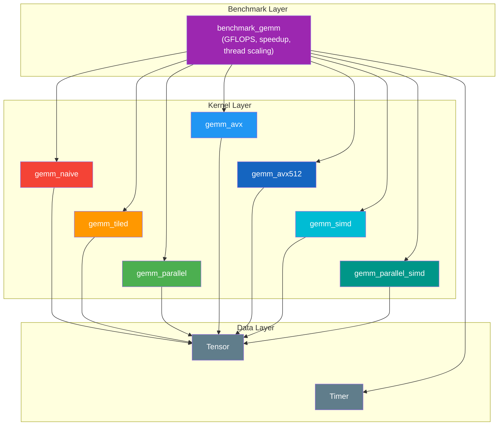
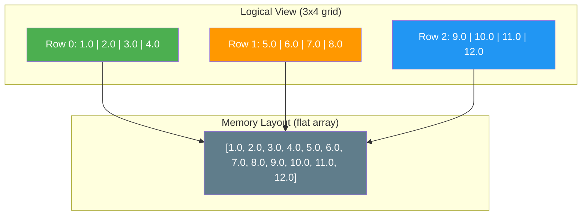
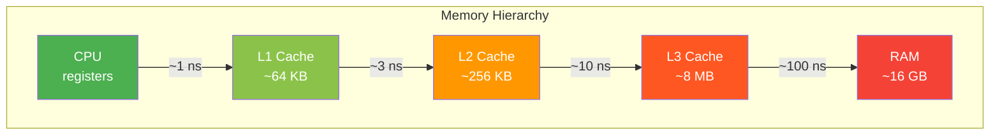
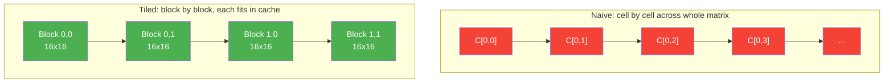
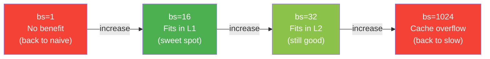
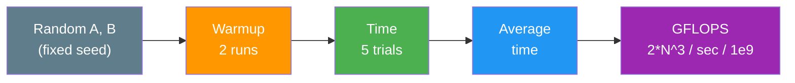

# GEMM Kernel Optimization Engine

**A C++17 tile-based matrix kernel runtime with AVX2/AVX-512 SIMD vectorization, cache-line-aligned memory, and OpenMP parallelism.**

Inspired by how ML accelerator runtimes (Graphcore Poplibs, XLA) schedule compute across tiles, this project implements progressively optimized GEMM kernels on CPU to explore the performance gap between naive and production-quality approaches.

```
=== N=1024 ===
  naive                      5454.15 ms      0.39 GFLOPS   (baseline)
  tiled  bs=16                646.11 ms      3.32 GFLOPS     8.4x
  parallel  bs=16  t=20       119.22 ms     18.01 GFLOPS    45.8x
  avx2+fma  bs=16              ...           ...            ...
  avx-512   bs=16              ...           ...            ...
  std-simd  bs=16              ...           ...            ...
  parallel+simd bs=16 t=20     ...           ...            ...
```

> Run `make bench` to see actual numbers on your hardware.

[View interactive performance chart](docs/gemm_performance_comparison.html)

---

## Features

- **Seven GEMM kernel variants** — naive, tiled, parallel, AVX2+FMA, AVX-512, std::experimental::simd, and parallel+SIMD
- **SIMD vectorization** — hand-tuned 4x8 (AVX2) and 4x16 (AVX-512) micro-kernels with FMA and prefetching
- **Cache-line-aligned memory** — 64-byte aligned allocator for Tensor storage, optimized for SIMD loads and cache efficiency
- **Runtime CPU detection** — CPUID-based feature detection guards SIMD kernel dispatch (AVX2, FMA, AVX-512F/VL)
- **Portable SIMD** — std::experimental::simd kernel demonstrates C++ standard SIMD abstraction vs hand-written intrinsics
- **Benchmark harness** — GFLOPS throughput, speedup vs baseline, block-size sweep, thread-scaling sweep
- **Custom Tensor class** — row-major contiguous storage with bounds-checked access and raw pointer hot paths
- **Correctness tests** — exhaustive validation across edge cases (1x1, non-square, non-power-of-2, non-SIMD-aligned dimensions)
- **Zero external dependencies** — pure C++17 + optional OpenMP, no Boost or GoogleTest
- **Cross-platform** — CI tested on GCC, Clang, and MSVC

## Quick Start

```bash
make          # build everything (CMake + Release mode)
make test     # run all 26 tests
make bench    # run GFLOPS benchmarks with thread scaling
make clean    # remove build directory
```

**Requirements:** C++17 compiler, CMake 3.14+. OpenMP is optional (auto-detected).

## Architecture



## Repository Layout

```text
.
├── benchmarks/
│   └── benchmark_gemm.cpp        # benchmark harness (GFLOPS, speedup, best-kernel)
├── docs/
│   └── design_decisions.md       # upfront design decisions
├── include/
│   ├── tensor.h                  # Tensor class (64-byte aligned storage)
│   ├── gemm.h                    # GEMM kernel declarations (7 variants)
│   ├── timer.h                   # Timer class
│   ├── aligned_allocator.h       # Cache-line-aligned allocator for std::vector
│   └── cpu_features.h            # Runtime CPUID detection (AVX2/FMA/AVX-512)
├── src/
│   ├── tensor.cpp                # Tensor implementation
│   ├── gemm_naive.cpp            # naive GEMM kernel
│   ├── gemm_tiled.cpp            # tiled GEMM kernel
│   ├── gemm_parallel.cpp         # OpenMP parallel GEMM kernel
│   ├── gemm_avx.cpp              # AVX2+FMA GEMM (4x8 micro-kernel)
│   ├── gemm_avx512.cpp           # AVX-512 GEMM (4x16 micro-kernel, masked edges)
│   ├── gemm_simd.cpp             # std::experimental::simd portable GEMM
│   └── gemm_parallel_simd.cpp    # OpenMP + AVX2 combined GEMM
├── tests/
│   ├── test_utils.h              # assertion macros
│   ├── test_tensor.cpp           # tensor tests (12 cases incl. alignment)
│   └── test_gemm.cpp             # GEMM correctness tests (20+ cases)
├── CMakeLists.txt
└── Makefile
```

## Kernel Comparison

| Kernel | Strategy | SIMD | Cores | Speedup (N=1024) |
|--------|----------|------|-------|-------------------|
| `gemm_naive` | Triple loop, one cell at a time | None | 1 | 1x (baseline) |
| `gemm_tiled` | Block loop, configurable tile size | None | 1 | ~8x |
| `gemm_parallel` | Block loop, tiles split across cores | None | All | ~46x |
| `gemm_avx` | Tiled + AVX2 4x8 micro-kernel + FMA + prefetch | AVX2 (8-wide) | 1 | Run `make bench` |
| `gemm_avx512` | Tiled + AVX-512 4x16 micro-kernel + masked edges | AVX-512 (16-wide) | 1 | Run `make bench` |
| `gemm_simd` | Tiled + std::experimental::simd (portable) | native_simd | 1 | Run `make bench` |
| `gemm_parallel_simd` | OpenMP parallel tiles + AVX2 inner loop | AVX2 (8-wide) | All | Run `make bench` |

### Thread Scaling

The parallel kernel distributes output tiles across CPU cores via OpenMP. Each thread owns distinct tiles — no synchronization needed:


At small matrix sizes (N=128), thread overhead can dominate — more threads actually hurts. At large N (1024+), scaling continues up to the hardware thread limit.

---

## How It Works

<details>
<summary><strong>The Tensor — row-major data layout</strong></summary>

A `Tensor` is a 2D grid stored as a flat array in row-major order:



Element at row `i`, col `j`: `index = i * cols + j`. This layout means traversing a row is sequential in memory (cache-friendly), but traversing a column jumps by `cols` each step.

</details>

<details>
<summary><strong>GEMM — General Matrix Multiply</strong></summary>

GEMM computes `C = A x B`. For each output cell, take a row from A and a column from B, multiply pair-by-pair, and sum:

```
A (2x3)         B (3x2)         C (2x2)

| 1  2  3 |     | 7   8 |      |  58  64 |
| 4  5  6 |  x  | 9  10 |  =   | 139 154 |
                | 11  12 |

C[0][0] = (1*7) + (2*9) + (3*11) = 58
```

Every neural network layer is dominated by matrix multiplications — optimizing GEMM is the single biggest lever for ML performance.

</details>

<details>
<summary><strong>Why naive GEMM is slow — the cache problem</strong></summary>

CPUs have a memory hierarchy: fast-but-tiny cache, slow-but-large RAM.



Naive GEMM reads columns of B, which jump through memory by stride — thrashing the cache. For 1024x1024 matrices, B is ~4MB and can't stay in cache, so the CPU keeps loading and evicting the same data.

</details>

<details>
<summary><strong>Tiled GEMM — the fix</strong></summary>

Instead of computing one cell at a time across the whole matrix, process small **blocks** that fit in cache:



A 16x16 tile = 1KB — fits easily in L1 cache. Same math, same result, just a smarter traversal order.

The benchmark sweeps block sizes to find the sweet spot — too small (bs=1) gives no benefit, too large (bs=1024) overflows the cache:



</details>

<details>
<summary><strong>Benchmark methodology</strong></summary>



Deterministic seeding ensures reproducible inputs. Warmup stabilizes CPU frequency scaling. Higher GFLOPS = faster kernel.

</details>

---

## Roadmap

- [x] **Phase 1** — Bootstrap repo layout and CMake build system
- [x] **Phase 2** — Tensor class with row-major storage, utility methods, and tests
- [x] **Phase 3** — Naive GEMM as correctness reference
- [x] **Phase 4** — Timer + benchmark harness (GFLOPS, speedup, block/thread sweep)
- [x] **Phase 5** — Tiled GEMM (cache-friendly block loop)
- [x] **Phase 6** — Parallel GEMM (OpenMP + thread scaling benchmark)
- [x] **Phase 6.5** — SIMD vectorization (AVX2+FMA, AVX-512, std-simd, parallel+SIMD, 64-byte aligned allocator, CPUID detection)
- [ ] **Phase 7** — TileTask abstraction and `make_tasks()` helper
- [ ] **Phase 8** — Minimal scheduler layer (static + work-stealing variant)
- [ ] **Phase 9** — Full test coverage including scheduler tests
- [ ] **Phase 10** — Docs: architecture, performance analysis, Graphcore-inspired design, `make profile` with `perf stat`
- [ ] **Phase 11** — Naive softmax kernel (row-wise, log-sum-exp trick)
- [ ] **Phase 12** — Tiled softmax with partial reduction + online (single-pass) softmax
- [ ] **Phase 13** — Parallel softmax (OpenMP, row-parallel + tiled reduction)
- [ ] **Phase 14** — Softmax benchmark integration (time, throughput, speedup sweep)

## Design Decisions

See [docs/design_decisions.md](docs/design_decisions.md) for rationale on bounds checking, output pre-allocation, row-major layout, namespace conventions, float tolerance, and the custom test framework.

---

## References

### Graphcore / IPU Architecture

- [Graphcore Poplibs](https://github.com/graphcore/poplibs) — open-source IPU kernel library this project draws inspiration from
- [IPU Programmer's Guide — About the IPU](https://docs.graphcore.ai/projects/ipu-programmers-guide/en/latest/about_ipu.html) — tile architecture, local SRAM, execution model
- [IPU Programmer's Guide — Programming Model](https://docs.graphcore.ai/projects/ipu-programmers-guide/en/latest/programming_model.html) — BSP compute/exchange phases
- [Graphcore Memory & Performance Optimisation Guide](https://docs.graphcore.ai/projects/memory-performance-optimisation/en/latest/understand-ipu-programming-model.html) — tile-local compute and exchange phase mechanics
- [Graphcore HPC Cookbook](https://github.com/graphcore/hpc-cookbook) — low-level Poplar C++ recipes including matrix multiplication patterns
- [How to Build a Processor for Machine Intelligence](https://www.graphcore.ai/posts/how-to-build-a-processor-for-machine-intelligence-part-2) — Graphcore CTO Simon Knowles on BSP, tile-local memory, and exchange
- Citadel Securities — *Dissecting the Graphcore IPU Architecture via Microbenchmarking* (2019): [arxiv.org/abs/1912.03413](https://arxiv.org/abs/1912.03413)

### Parallel Computing & BSP

- Leslie G. Valiant — *A Bridging Model for Parallel Computation*, CACM 1990: [dl.acm.org/doi/10.1145/79173.79181](https://dl.acm.org/doi/10.1145/79173.79181) — foundational BSP paper
- [OpenMP API Specification](https://www.openmp.org/specifications/) — parallelism model used in `gemm_parallel`

### GEMM & Cache Optimization

- Goto & van de Geijn — *Anatomy of High-Performance Matrix Multiplication*, TOMS 2008: [dl.acm.org/doi/10.1145/1356052.1356053](https://dl.acm.org/doi/10.1145/1356052.1356053) — the canonical reference for cache-aware tiling strategy

### SIMD & Vectorization

- [Intel Intrinsics Guide](https://www.intel.com/content/www/us/en/docs/intrinsics-guide/index.html) — reference for AVX2/AVX-512 intrinsics used in `gemm_avx` and `gemm_avx512`
- [ISO/IEC TS 19570:2018 — std::experimental::simd](https://en.cppreference.com/w/cpp/experimental/simd) — C++ portable SIMD abstraction used in `gemm_simd`

### Softmax & Online Algorithms

- Tri Dao et al. — *FlashAttention: Fast and Memory-Efficient Exact Attention with IO-Awareness*, NeurIPS 2022: [arxiv.org/abs/2205.14135](https://arxiv.org/abs/2205.14135) — online softmax (single-pass log-sum-exp), the basis for Phase 12
