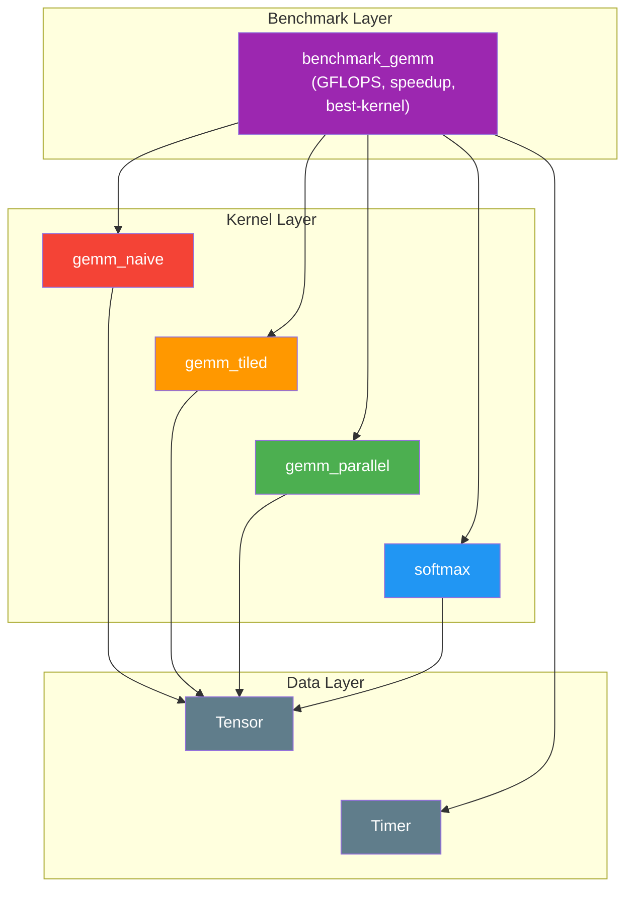
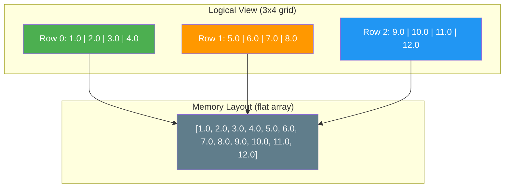
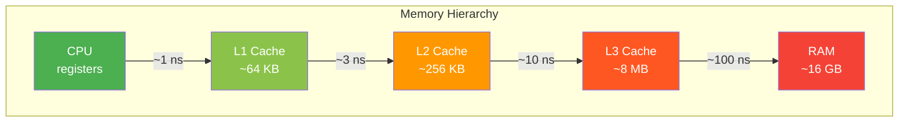
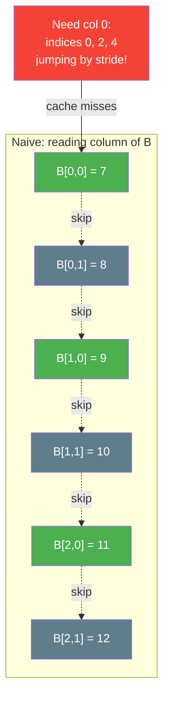
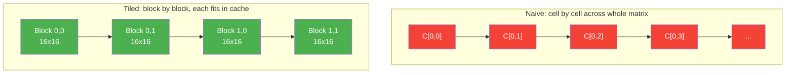
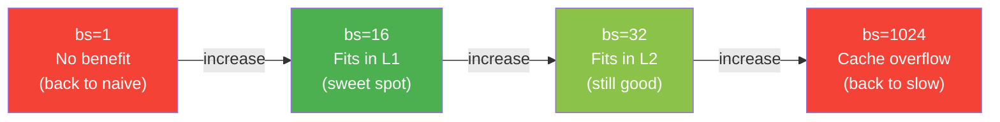
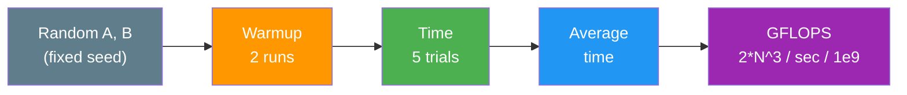
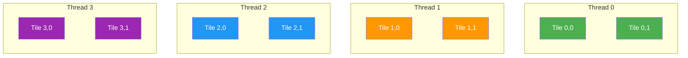
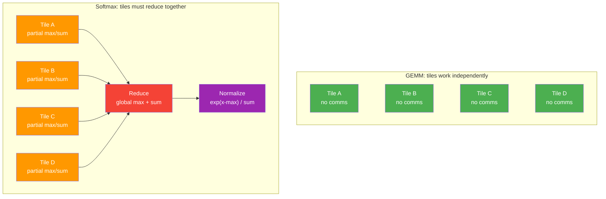

# Tile Based ML Kernel Runtime

A C++17 systems project that implements and benchmarks tile-based matrix kernels
with simple runtime-style scheduling, inspired by ML kernel runtimes such as
Graphcore Poplibs.



---

## How It Works

### 1. The Tensor — Your Data Container

Think of a `Tensor` like a spreadsheet grid. It has rows and columns, and each cell holds a number. But in memory, there's no grid — it's a flat list of numbers read left-to-right, top-to-bottom (**row-major** layout):



To find element at row 2, col 1: `index = 2 * 4 + 1 = 9` -> `10.0`

### 2. Matrix Multiplication (GEMM)

GEMM = **G**eneral **M**atrix **M**ultiply. It computes `C = A x B`. For each output cell, take a row from A and a column from B, multiply pair-by-pair, and sum:

```
A (2x3)         B (3x2)         C (2x2)

| 1  2  3 |     | 7   8 |      |  58  64 |
| 4  5  6 |  x  | 9  10 |  =   | 139 154 |
                | 11  12 |

C[0][0] = (1*7) + (2*9) + (3*11) = 58
C[0][1] = (1*8) + (2*10) + (3*12) = 64
```

**Why does this matter?** Every neural network is mostly matrix multiplications — GEMM is the bottleneck.

### 3. The Cache Problem — Why Naive Is Slow

Your CPU has fast but tiny **cache** and slow but large **RAM**. Naive GEMM reads columns of B, which jump around in memory — thrashing the cache:





For 1024x1024 matrices, B is ~4MB. The cache can't hold it all, so naive GEMM keeps loading and evicting the same data.

### 4. Tiled GEMM — The Fix

Think of it like washing dishes:
- **Naive** = pick up one dish, wash it, put it down, repeat. No strategy.
- **Tiled** = group dishes into stacks. Wash one whole stack before moving on.

Instead of one cell at a time, grab a small **block** of A and B that fits in cache, do all the work, then move on:



A 16x16 block = 1KB — fits easily in L1 cache. Every access is fast while you're inside that block.

**Same math, same result, just a smarter order of operations.**

### 5. Block Size — Finding the Sweet Spot



The benchmark sweeps multiple block sizes to find what works best on your hardware.

### 6. The Benchmark Harness



Higher GFLOPS = faster kernel. The benchmark also sweeps thread counts (1, 2, 4, 8, ...) to show parallel scaling. Example output:

```
=== N=1024 ===
  naive                      5454.15 ms      0.39 GFLOPS   (baseline)
  tiled  bs=16                646.11 ms      3.32 GFLOPS     8.4x
  tiled  bs=32               1628.45 ms      1.32 GFLOPS     3.3x
  tiled  bs=64               1592.13 ms      1.35 GFLOPS     3.4x
  parallel  bs=16             679.32 ms      3.16 GFLOPS     8.0x
  parallel  bs=16  t=2        351.27 ms      6.11 GFLOPS    15.5x
  parallel  bs=16  t=4        238.11 ms      9.02 GFLOPS    22.9x
  parallel  bs=16  t=8        169.80 ms     12.65 GFLOPS    32.1x
  parallel  bs=16  t=16       128.50 ms     16.71 GFLOPS    42.4x
  parallel  bs=16  t=20       119.22 ms     18.01 GFLOPS    45.8x
  best: parallel bs=16 t=20
```

### 7. Parallel GEMM — Multi-Core Scaling

The parallel kernel splits output tiles across CPU cores using OpenMP. Each core owns distinct tiles, so no synchronization is needed:



The thread scaling sweep reveals diminishing returns — at small N (128), too many threads actually *hurts* because the overhead of creating/synchronizing threads exceeds the compute time. At large N (1024), more threads keep helping up to the hardware limit.

### 8. Kernel Comparison

| Kernel | Strategy | Cache | Cores | Speedup (N=1024) |
|--------|----------|-------|-------|------------------|
| `gemm_naive` | Triple loop, one cell | Poor | 1 | 1x (baseline) |
| `gemm_tiled` | Block loop, one tile | Good | 1 | ~8x |
| `gemm_parallel` | Block loop, split tiles | Good | All | ~46x |

### 9. Coming Next — Softmax (The Hard Parallelism Problem)

GEMM tiles are **independent** — no communication needed. Softmax requires **reduction** across tiles: each tile computes a partial max and sum, then they must exchange results before normalizing. This mirrors how Graphcore's IPU handles BSP (Bulk Synchronous Parallel) communication.



---

## Current Status

Phases 1-6 are complete:

- **Tensor class** — row-major `std::vector<float>` storage with bounds-checked `at()`, raw `data()` pointer, `fill`, `zero`, `randomize(seed)`
- **Naive GEMM** — triple-loop `gemm_naive(A, B, C)` with dimension validation
- **Tiled GEMM** — cache-friendly block-based `gemm_tiled(A, B, C, block_size)` with configurable tile size
- **Parallel GEMM** — OpenMP-parallelized tiled GEMM with `collapse(2)` over output tiles, thread count configurable at runtime
- **Timer** — `std::chrono`-based high-resolution timer for benchmarking
- **Benchmark harness** — grouped output by matrix size, GFLOPS reporting, speedup vs baseline, thread scaling sweep (1/2/4/8/.../max), best-kernel summary
- **Test suite** — tensor tests (11 cases) and GEMM correctness tests (15 cases: 7 naive + 4 tiled + 4 parallel) using a minimal in-repo assertion framework

Upcoming: softmax kernels, scheduler abstraction, docs.

## Repository Layout

```text
.
├── benchmarks/
│   └── benchmark_gemm.cpp        # benchmark harness (GFLOPS, speedup, best-kernel)
├── docs/
│   └── design_decisions.md       # upfront design decisions
├── include/
│   ├── tensor.h                  # Tensor class
│   ├── gemm.h                    # GEMM kernel declarations
│   └── timer.h                   # Timer class
├── src/
│   ├── tensor.cpp                # Tensor implementation
│   ├── gemm_naive.cpp            # naive GEMM kernel
│   ├── gemm_tiled.cpp            # tiled GEMM kernel
│   └── gemm_parallel.cpp         # OpenMP parallel GEMM kernel
├── tests/
│   ├── test_utils.h              # assertion macros
│   ├── test_tensor.cpp           # tensor tests (11 cases)
│   └── test_gemm.cpp             # GEMM correctness tests (15 cases)
├── CMakeLists.txt
├── Makefile
└── tile_runtime.plan.md
```

## Quick Start

```bash
make          # build everything
make test     # run all tests
make bench    # run benchmarks
make clean    # remove build directory
```

## Notes

- OpenMP is detected and linked automatically when available.
- All code lives in the `tile_runtime::` namespace.
- See [docs/design_decisions.md](docs/design_decisions.md) for design rationale.
