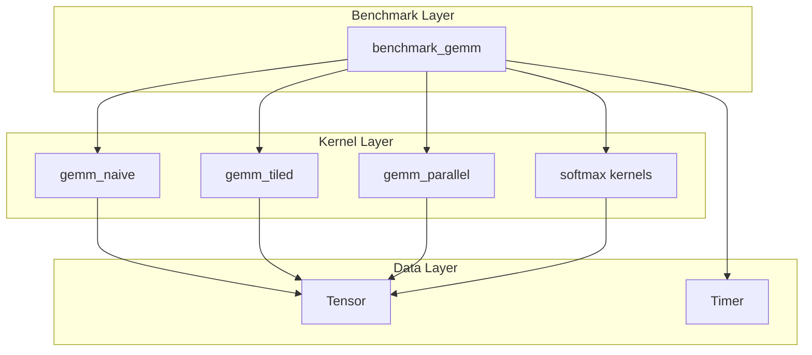
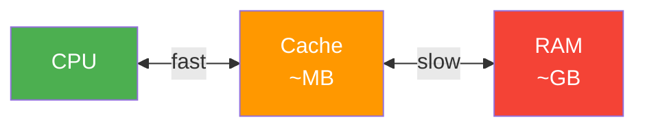
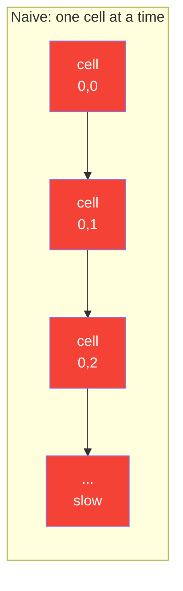
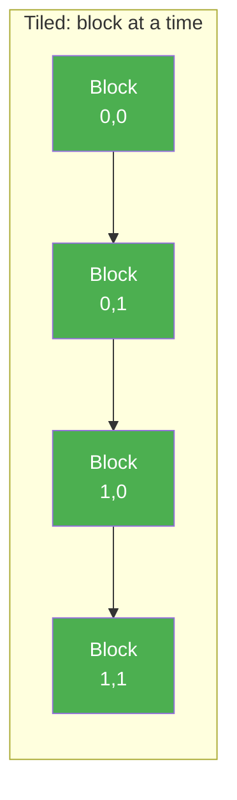
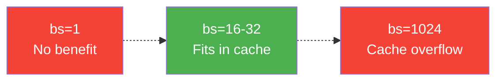
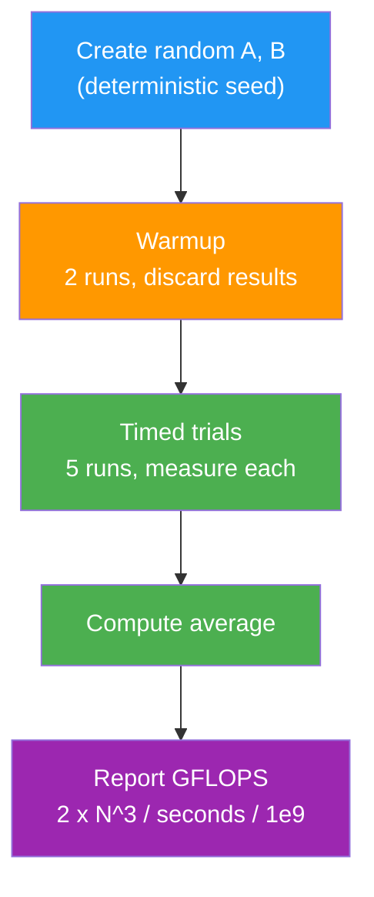
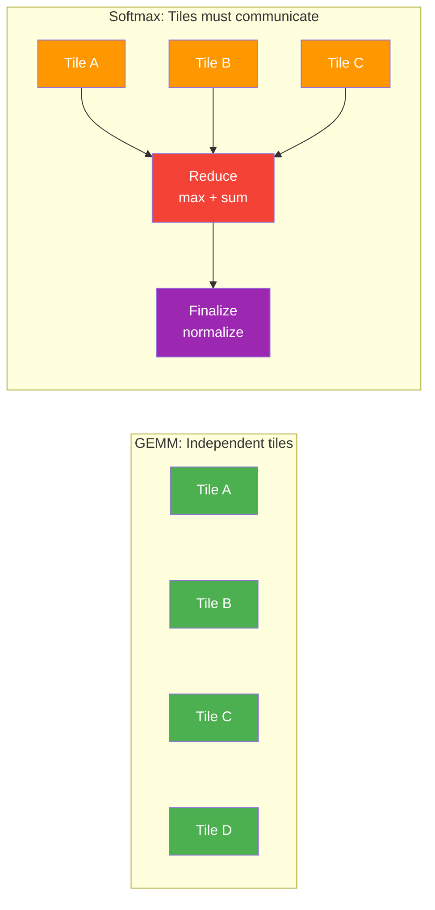

# Tile Based ML Kernel Runtime

A C++17 systems project that implements and benchmarks tile-based matrix kernels
with simple runtime-style scheduling, inspired by ML kernel runtimes such as
Graphcore Poplibs.

## Project Goal

Build a clean, testable runtime scaffold that evolves from:

1. baseline matrix operations
2. tiled and parallel GEMM kernels
3. task partitioning and scheduler dispatch
4. reproducible benchmarking and performance analysis

## Architecture



## How It Works

### The Tensor — Your Data Container

Think of a `Tensor` like a spreadsheet grid. It has rows and columns, and each cell holds a number.

```
Tensor A (3 rows x 4 cols):

  | col0 | col1 | col2 | col3 |
--+------+------+------+------+
0 |  1.0 |  2.0 |  3.0 |  4.0 |
1 |  5.0 |  6.0 |  7.0 |  8.0 |
2 |  9.0 | 10.0 | 11.0 | 12.0 |
```

But in memory, there's no grid. It's just a flat list of numbers, read left-to-right, top-to-bottom:

```
Memory: [1.0, 2.0, 3.0, 4.0, 5.0, 6.0, 7.0, 8.0, 9.0, 10.0, 11.0, 12.0]
         ---- row 0 ----  ---- row 1 ----  -------- row 2 --------
```

To find element at row 2, col 1: `index = 2 * 4 + 1 = 9` -> that's `10.0`. This is called **row-major** layout.

### Matrix Multiplication (GEMM) — The Core Operation

GEMM = **G**eneral **M**atrix **M**ultiply. It computes `C = A x B`.

For each cell in the result, you take a row from A and a column from B, multiply them pair-by-pair, and add up:

```
A (2x3)         B (3x2)         C (2x2)

| 1  2  3 |     | 7   8 |      |  58  64 |
| 4  5  6 |  x  | 9  10 |  =   | 139 154 |
                | 11  12 |
```

```
C[0][0] = (1x7) + (2x9) + (3x11) = 7 + 18 + 33 = 58
C[0][1] = (1x8) + (2x10) + (3x12) = 8 + 20 + 36 = 64
```

This is what `gemm_naive` does — one cell at a time, three nested loops.

**Why does this matter?** Every neural network is mostly matrix multiplications. When you run ChatGPT, image recognition, anything ML — the bottleneck is GEMM.

### Why Naive Is Slow — The Cache Problem

Your CPU has a small, very fast memory called **cache** (like a desk), and a large, slow memory called **RAM** (like a filing cabinet).



Naive GEMM jumps around memory randomly. When computing one cell of C, it reads a row of A (consecutive — good) but then reads a **column** of B (jumping across rows — terrible for cache).

For a 1024x1024 matrix, B has ~4MB of data. The CPU cache can only hold parts of it. Naive GEMM keeps loading and evicting the same data over and over — the CPU spends most of its time waiting for memory.

### Why Tiled Is Fast — Working In Blocks

Think of it like washing dishes.

**Naive** = pick up one dish, wash it, put it down. Pick up the next dish. One at a time, no strategy.

**Tiled** = group dishes into stacks of 16 (or 32, or 64). Wash one whole stack, then the next stack. The "block size" is how big each stack is.

Tiled GEMM says: instead of computing one cell at a time across the whole matrix, **grab a small block of A and a small block of B that both fit in cache**, and do all the work on those blocks before moving on.





A 16x16 block of floats = 1KB. That fits easily in cache. So while you're working on that block, every memory access is **fast** — it's already on your "desk."

Same math, same result, just a smarter order of operations.

### Why Block Size Matters



- **Too small** (bs=1) — you're back to one-at-a-time, no benefit from blocking.
- **Too big** (bs=1024) — the block doesn't fit in cache anymore, same problem as naive.
- **Sweet spot** (bs=16 or 32) — blocks fit in L1/L2 cache perfectly.

That's why the benchmark tests multiple block sizes — to find the sweet spot for your hardware.

### The Benchmark Harness



Higher GFLOPS = faster kernel.

### Kernel Comparison

| Kernel | Strategy | Cache Behavior | Parallelism |
|--------|----------|----------------|-------------|
| `gemm_naive` | Triple loop, one cell at a time | Poor — random access on B | Single core |
| `gemm_tiled` | Block loop, one tile at a time | Good — blocks fit in cache | Single core |
| `gemm_parallel` | Block loop across cores | Good — each core owns tiles | Multi-core (OpenMP) |

### What's Next — Softmax (Reduction Pattern)

GEMM is **embarrassingly parallel** — each output cell is independent. Softmax is the opposite: it requires **cross-tile reduction**, which mirrors how Graphcore's IPU handles BSP communication.



## Current Status

Phases 1-5 are complete:

- **Tensor class** — row-major `std::vector<float>` storage with bounds-checked `at()`, raw `data()` pointer, `fill`, `zero`, `randomize(seed)`
- **Naive GEMM** — triple-loop `gemm_naive(A, B, C)` with dimension validation
- **Tiled GEMM** — cache-friendly block-based `gemm_tiled(A, B, C, block_size)` with configurable tile size
- **Timer** — `std::chrono`-based high-resolution timer for benchmarking
- **Benchmark harness** — grouped output by matrix size, GFLOPS reporting, speedup vs baseline, best-kernel summary
- **Test suite** — tensor tests (11 cases) and GEMM correctness tests (7 cases) using a minimal in-repo assertion framework

Upcoming: parallel GEMM (OpenMP), softmax kernels, scheduler abstraction, docs.

## Repository Layout

```text
.
├── benchmarks/
│   └── benchmark_gemm.cpp        # benchmark harness (GFLOPS, speedup, best-kernel)
├── docs/
│   └── design_decisions.md       # upfront design decisions
├── include/
│   ├── tensor.h                  # Tensor class
│   ├── gemm.h                    # GEMM kernel declarations
│   └── timer.h                   # Timer class
├── scripts/
├── src/
│   ├── tensor.cpp                # Tensor implementation
│   ├── gemm_naive.cpp            # naive GEMM kernel
│   └── gemm_tiled.cpp            # tiled GEMM kernel
├── tests/
│   ├── test_utils.h              # assertion macros (ASSERT_TRUE, ASSERT_NEAR, etc.)
│   ├── test_tensor.cpp           # tensor tests
│   └── test_gemm.cpp             # GEMM correctness tests
├── CMakeLists.txt
├── Makefile                      # convenience targets (make, make test, make bench, make clean)
└── tile_runtime.plan.md
```

## Quick Start

```bash
make          # build everything
make test     # run all tests
make bench    # run benchmarks
make clean    # remove build directory
```

Or manually with CMake:

```bash
cmake -S . -B build -DCMAKE_BUILD_TYPE=Release
cmake --build build
cd build && ctest --output-on-failure
```

## Run Individual Tests

```bash
./build/test_tensor
./build/test_gemm
```

## Notes

- OpenMP is detected and linked automatically when available.
- All code lives in the `tile_runtime::` namespace.
- See [docs/design_decisions.md](docs/design_decisions.md) for rationale on bounds checking, output tensor ownership, memory layout, and testing conventions.
