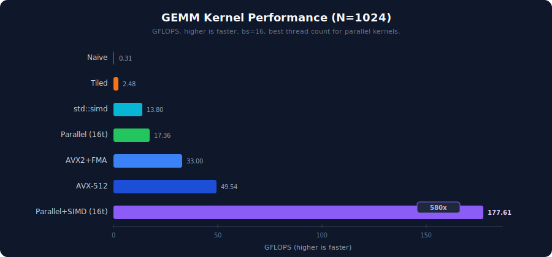
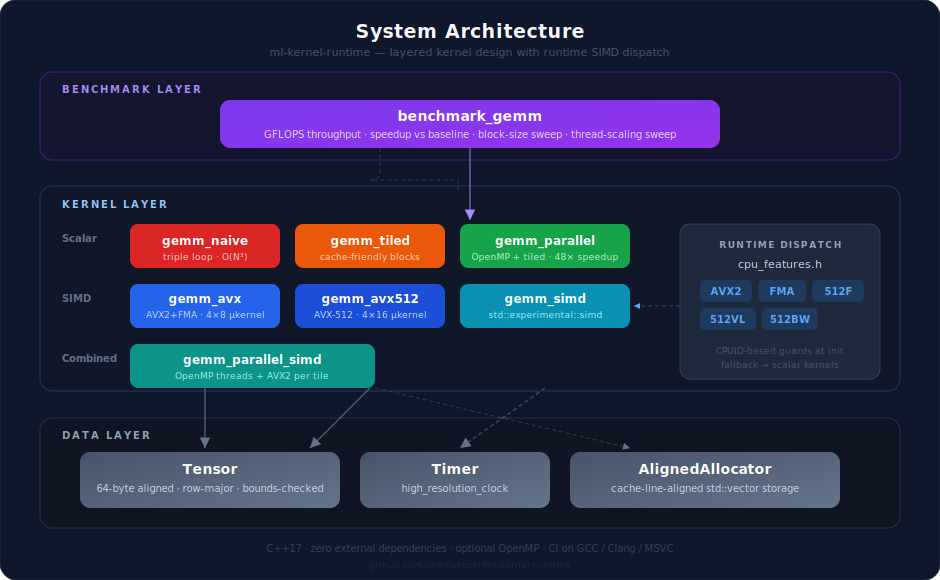
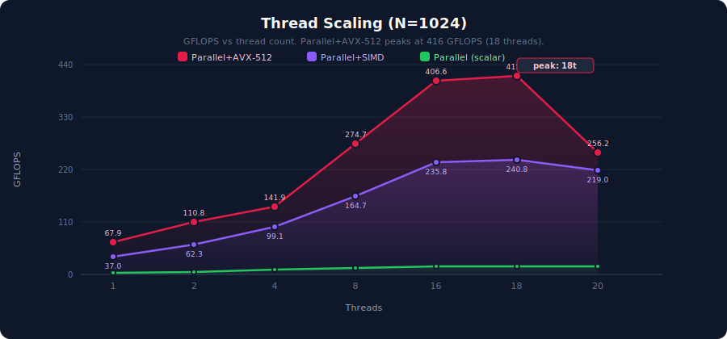

# GEMM Kernel Optimization Engine

**A C++17 tile-based matrix kernel runtime with AVX2/AVX-512 SIMD vectorization, cache-line-aligned memory, and OpenMP parallelism.**

Inspired by how ML accelerator runtimes (Graphcore Poplibs, XLA) schedule compute across tiles, this project implements progressively optimized GEMM kernels on CPU to explore the performance gap between naive and production-quality approaches.

```
=== N=1024 ===
  naive                       7007.64 ms      0.31 GFLOPS   (baseline)
  tiled  bs=16                 866.00 ms      2.48 GFLOPS      8.1x
  parallel  bs=16  t=16        123.70 ms     17.36 GFLOPS     56.7x
  avx2+fma  bs=16               65.07 ms     33.00 GFLOPS    107.7x
  avx-512   bs=16               43.35 ms     49.54 GFLOPS    161.7x
  std-simd  bs=16              155.57 ms     13.80 GFLOPS     45.0x
  parallel+simd bs=16 t=16      12.09 ms    177.61 GFLOPS    579.6x
```

> Run `make bench` to see actual numbers on your hardware.

[](https://shamykyzer.github.io/ml-kernel-runtime/gemm_performance_comparison.html)



---

## Features

- **Seven GEMM kernel variants:** naive, tiled, parallel, AVX2+FMA, AVX-512, std::experimental::simd, and parallel+SIMD
- **SIMD vectorization:** hand-tuned 4x8 (AVX2) and 4x16 (AVX-512) micro-kernels with FMA and prefetching
- **Cache-line-aligned memory:** 64-byte aligned allocator for Tensor storage, optimized for SIMD loads and cache efficiency
- **Runtime CPU detection:** CPUID-based feature detection guards SIMD kernel dispatch (AVX2, FMA, AVX-512F/VL)
- **Portable SIMD:** std::experimental::simd kernel demonstrates C++ standard SIMD abstraction vs hand-written intrinsics
- **Benchmark harness:** GFLOPS throughput, speedup vs baseline, block-size sweep, thread-scaling sweep
- **Custom Tensor class:** row-major contiguous storage with bounds-checked access and raw pointer hot paths
- **Correctness tests:** exhaustive validation across edge cases (1x1, non-square, non-power-of-2, non-SIMD-aligned dimensions)
- **Zero external dependencies:** pure C++17 + optional OpenMP, no Boost or GoogleTest
- **Cross-platform:** CI tested on GCC, Clang, and MSVC

## Quick Start

```bash
make          # build everything (CMake + Release mode)
make test     # run all 26 tests
make bench    # run GFLOPS benchmarks with thread scaling
make clean    # remove build directory
```

**Requirements:** C++17 compiler, CMake 3.14+. OpenMP is optional (auto-detected).

## Architecture



## Repository Layout

```text
.
├── benchmarks/
│   └── benchmark_gemm.cpp        # benchmark harness (GFLOPS, speedup, best-kernel)
├── docs/
│   └── design_decisions.md       # upfront design decisions
├── include/
│   ├── tensor.h                  # Tensor class (64-byte aligned storage)
│   ├── gemm.h                    # GEMM kernel declarations (7 variants)
│   ├── timer.h                   # Timer class
│   ├── aligned_allocator.h       # Cache-line-aligned allocator for std::vector
│   └── cpu_features.h            # Runtime CPUID detection (AVX2/FMA/AVX-512)
├── src/
│   ├── tensor.cpp                # Tensor implementation
│   ├── gemm_naive.cpp            # naive GEMM kernel
│   ├── gemm_tiled.cpp            # tiled GEMM kernel
│   ├── gemm_parallel.cpp         # OpenMP parallel GEMM kernel
│   ├── gemm_avx.cpp              # AVX2+FMA GEMM (4x8 micro-kernel)
│   ├── gemm_avx512.cpp           # AVX-512 GEMM (4x16 micro-kernel, masked edges)
│   ├── gemm_simd.cpp             # std::experimental::simd portable GEMM
│   └── gemm_parallel_simd.cpp    # OpenMP + AVX2 combined GEMM
├── tests/
│   ├── test_utils.h              # assertion macros
│   ├── test_tensor.cpp           # tensor tests (12 cases incl. alignment)
│   └── test_gemm.cpp             # GEMM correctness tests (20+ cases)
├── CMakeLists.txt
└── Makefile
```

## Kernel Comparison

| Kernel | Strategy | SIMD | Cores | Speedup (N=1024) |
|--------|----------|------|-------|-------------------|
| `gemm_naive` | Triple loop, one cell at a time | None | 1 | 1x (baseline) |
| `gemm_tiled` | Block loop, configurable tile size | None | 1 | ~8x |
| `gemm_parallel` | Block loop, tiles split across cores | None | All | ~46x |
| `gemm_avx` | Tiled + AVX2 4x8 micro-kernel + FMA + prefetch | AVX2 (8-wide) | 1 | Run `make bench` |
| `gemm_avx512` | Tiled + AVX-512 4x16 micro-kernel + masked edges | AVX-512 (16-wide) | 1 | Run `make bench` |
| `gemm_simd` | Tiled + std::experimental::simd (portable) | native_simd | 1 | Run `make bench` |
| `gemm_parallel_simd` | OpenMP parallel tiles + AVX2 inner loop | AVX2 (8-wide) | All | Run `make bench` |

### SIMD Micro-Kernel Register Tiling


### Thread Scaling

The parallel kernel distributes output tiles across CPU cores via OpenMP. Each thread owns distinct tiles, so no synchronization is needed:


At small matrix sizes (N=128), thread overhead dominates and adding more threads actually hurts. At large N (1024+), scaling continues up to the hardware thread limit.



---

## How It Works

<details>
<summary><strong>The Tensor: Row-Major Data Layout</strong></summary>

A `Tensor` is a 2D grid stored as a flat array in row-major order:


Element at row `i`, col `j`: `index = i * cols + j`. This layout means traversing a row is sequential in memory (cache-friendly), but traversing a column jumps by `cols` each step.

</details>

<details>
<summary><strong>GEMM: General Matrix Multiply</strong></summary>

GEMM computes `C = A x B`. For each output cell, take a row from A and a column from B, multiply pair-by-pair, and sum:

```
A (2x3)         B (3x2)         C (2x2)

| 1  2  3 |     | 7   8 |      |  58  64 |
| 4  5  6 |  x  | 9  10 |  =   | 139 154 |
                | 11  12 |

C[0][0] = (1*7) + (2*9) + (3*11) = 58
```

Every neural network layer is dominated by matrix multiplications. Optimizing GEMM is the single biggest lever for ML performance.

</details>

<details>
<summary><strong>Why Naive GEMM Is Slow</strong></summary>

CPUs have a memory hierarchy: fast-but-tiny cache, slow-but-large RAM.


Naive GEMM reads columns of B, which jump through memory by stride, thrashing the cache. For 1024x1024 matrices, B is ~4MB and can't stay in cache, so the CPU keeps loading and evicting the same data.

</details>

<details>
<summary><strong>Tiled GEMM: The Fix</strong></summary>

Instead of computing one cell at a time across the whole matrix, process small **blocks** that fit in cache:


A 16x16 tile = 1KB, which fits easily in L1 cache. Same math, same result, just a smarter traversal order.

</details>

<details>
<summary><strong>AVX-512: Wider Registers, Masked Edges</strong></summary>

AVX-512 doubles the register width to 512 bits (16 floats per ZMM register), giving a 4x16 micro-kernel that processes 128 FLOPs per k-step, delivering 2x the throughput of AVX2.

The key advantage beyond raw width is **masked operations** (`__mmask16`). When matrix dimensions aren't multiples of 16, AVX2 falls back to scalar cleanup loops. AVX-512 uses `_mm512_maskz_loadu_ps` and `_mm512_mask_storeu_ps` to process partial vectors in a single instruction with no branch and no scalar tail.

```
Full 16-wide:    [b₀ b₁ b₂ b₃ b₄ b₅ b₆ b₇ b₈ b₉ b₁₀ b₁₁ b₁₂ b₁₃ b₁₄ b₁₅]
Masked (N%16=5): [b₀ b₁ b₂ b₃ b₄  0  0  0  0  0   0   0   0   0   0   0 ]
                  └─────────────────┘ mask = 0b0000000000011111
```

Runtime CPUID guards (`cpu_features.h`) check for AVX-512F and AVX-512VL before dispatching to this kernel.

</details>

<details>
<summary><strong>std::experimental::simd: Portable SIMD</strong></summary>

Hand-written intrinsics (`_mm256_fmadd_ps`, `_mm512_fmadd_ps`) are fast but tied to specific ISAs. `std::experimental::simd` (ISO/IEC TS 19570) provides a portable abstraction that maps to the best available SIMD on the target:

```cpp
using simd_f = stdx::native_simd<float>;  // auto-selects width
constexpr size_t W = simd_f::size();      // 8 on AVX2, 16 on AVX-512

simd_f c_vec;
c_vec.copy_from(&c[i * N + j], stdx::element_aligned);
for (size_t k = kk; k < k_end; ++k) {
    simd_f a_val(a[i * K + k]);           // broadcast
    simd_f b_vec;
    b_vec.copy_from(&b[k * N + j], stdx::element_aligned);
    c_vec += a_val * b_vec;               // FMA on supported hardware
}
c_vec.copy_to(&c[i * N + j], stdx::element_aligned);
```

Trade-off: roughly the same performance as hand-tuned AVX2 on GCC with `-O3`, but no register tiling (1-row kernel vs 4-row micro-kernel), no prefetching, and no masked edge handling. The gap widens at non-aligned dimensions.

</details>

<details>
<summary><strong>Parallel + SIMD: Combining Both</strong></summary>

`gemm_parallel_simd` combines OpenMP tile distribution with AVX2 4x8 micro-kernels inside each tile. Each thread gets its own tile region (no synchronization), and within each tile the inner loops use FMA intrinsics with prefetching.

```
Thread 0: tile(0,0) → AVX2 4x8 micro-kernel inside
Thread 1: tile(1,0) → AVX2 4x8 micro-kernel inside
Thread 2: tile(2,0) → AVX2 4x8 micro-kernel inside
...
```

This is the fastest kernel in the project. It exploits both instruction-level parallelism (SIMD) and thread-level parallelism (OpenMP) simultaneously.

</details>

<details>
<summary><strong>Benchmark Methodology</strong></summary>


Deterministic seeding ensures reproducible inputs. Warmup stabilizes CPU frequency scaling. Higher GFLOPS = faster kernel.

</details>

---

## Roadmap


## Design Decisions

See [docs/design_decisions.md](docs/design_decisions.md) for rationale on bounds checking, output pre-allocation, row-major layout, namespace conventions, float tolerance, and the custom test framework.

---

## References

### Graphcore / IPU Architecture

- [Graphcore Poplibs](https://github.com/graphcore/poplibs): open-source IPU kernel library this project draws inspiration from
- [IPU Programmer's Guide: About the IPU](https://docs.graphcore.ai/projects/ipu-programmers-guide/en/latest/about_ipu.html): tile architecture, local SRAM, execution model
- [IPU Programmer's Guide: Programming Model](https://docs.graphcore.ai/projects/ipu-programmers-guide/en/latest/programming_model.html): BSP compute/exchange phases
- [Graphcore Memory & Performance Optimisation Guide](https://docs.graphcore.ai/projects/memory-performance-optimisation/en/latest/understand-ipu-programming-model.html): tile-local compute and exchange phase mechanics
- [Graphcore HPC Cookbook](https://github.com/graphcore/hpc-cookbook): low-level Poplar C++ recipes including matrix multiplication patterns
- [How to Build a Processor for Machine Intelligence](https://www.graphcore.ai/posts/how-to-build-a-processor-for-machine-intelligence-part-2): Graphcore CTO Simon Knowles on BSP, tile-local memory, and exchange
- Citadel Securities, *Dissecting the Graphcore IPU Architecture via Microbenchmarking* (2019): [arxiv.org/abs/1912.03413](https://arxiv.org/abs/1912.03413)

### Parallel Computing & BSP

- Leslie G. Valiant, *A Bridging Model for Parallel Computation*, CACM 1990: [dl.acm.org/doi/10.1145/79173.79181](https://dl.acm.org/doi/10.1145/79173.79181) (foundational BSP paper)
- [OpenMP API Specification](https://www.openmp.org/specifications/): parallelism model used in `gemm_parallel`

### GEMM & Cache Optimization

- Goto & van de Geijn, *Anatomy of High-Performance Matrix Multiplication*, TOMS 2008: [dl.acm.org/doi/10.1145/1356052.1356053](https://dl.acm.org/doi/10.1145/1356052.1356053) (the canonical reference for cache-aware tiling strategy)

### SIMD & Vectorization

- [Intel Intrinsics Guide](https://www.intel.com/content/www/us/en/docs/intrinsics-guide/index.html): reference for AVX2/AVX-512 intrinsics used in `gemm_avx` and `gemm_avx512`
- [Intel AVX-512 Overview](https://www.intel.com/content/www/us/en/developer/articles/technical/intel-avx-512-instructions.html): architecture overview of 512-bit extensions, mask registers, and new instruction classes
- [Intel 64 and IA-32 Architectures Software Developer Manuals](https://www.intel.com/content/www/us/en/developer/articles/technical/intel-sdm.html): authoritative ISA reference for AVX-512F, AVX-512VL, and masked operations
- [ISO/IEC TS 19570:2018, std::experimental::simd](https://en.cppreference.com/w/cpp/experimental/simd): C++ portable SIMD abstraction used in `gemm_simd`
- Matthias Kretz, [*Data-Parallel Types for C++ (P0214)*](https://wg21.link/P0214): the C++ standards proposal behind `std::experimental::simd`, covering design rationale and ABI considerations
- [GCC libstdc++ SIMD documentation](https://gcc.gnu.org/onlinedocs/libstdc++/manual/ext_simd.html): implementation notes for the `std::experimental::simd` used in this project

### Softmax & Online Algorithms

- Tri Dao et al., *FlashAttention: Fast and Memory-Efficient Exact Attention with IO-Awareness*, NeurIPS 2022: [arxiv.org/abs/2205.14135](https://arxiv.org/abs/2205.14135) (online softmax / single-pass log-sum-exp, the basis for Phase 12)
