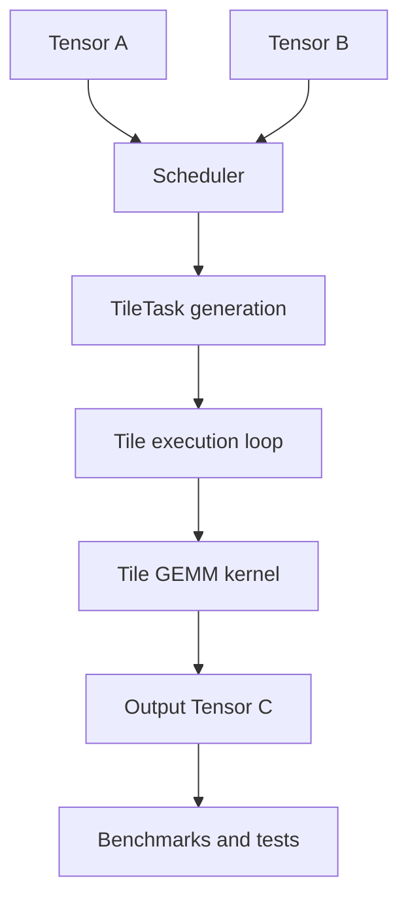

# Tile Runtime Implementation Plan

## Current State

- Existing repo content is minimal: [README.md](/home/shamy/ml-kernel-runtime/README.md) contains only the project one-line summary.
- No build system, source tree, tests, benchmarks, or docs exist yet, so this should be treated as a greenfield implementation.

## Defaults To Use

- Language/build: C++17 + CMake.
- Parallelism: OpenMP when available.
- Testing: a small in-repo test executable under [tests/](/home/shamy/ml-kernel-runtime/tests) rather than introducing GoogleTest in v1.
- Matrix type: `Tensor` with contiguous row-major `std::vector<float>` storage.
- Benchmark focus: square GEMM first, with repeatable warmup/timing and GFLOPS reporting.

## Phase 1: Bootstrap The Repo

- Create the source layout from your spec: [include/](/home/shamy/ml-kernel-runtime/include), [src/](/home/shamy/ml-kernel-runtime/src), [tests/](/home/shamy/ml-kernel-runtime/tests), [benchmarks/](/home/shamy/ml-kernel-runtime/benchmarks), [docs/](/home/shamy/ml-kernel-runtime/docs), and [scripts/](/home/shamy/ml-kernel-runtime/scripts).
- Add [CMakeLists.txt](/home/shamy/ml-kernel-runtime/CMakeLists.txt) that:
  - sets `CMAKE_CXX_STANDARD 17`
  - enables warnings and optimized `Release` flags
  - discovers/links OpenMP if present
  - builds a reusable library target for core runtime code
  - builds separate `benchmark_gemm` and `test_runtime` executables
- Expand [README.md](/home/shamy/ml-kernel-runtime/README.md) into a real project overview with build/run instructions and project goals.

## Phase 2: Build The Core Data Layer

- Implement [include/tensor.h](/home/shamy/ml-kernel-runtime/include/tensor.h) and [src/tensor.cpp](/home/shamy/ml-kernel-runtime/src/tensor.cpp).
- Keep the API close to your spec:

```cpp
  class Tensor {
  public:
      Tensor();
      Tensor(size_t rows, size_t cols);
      Tensor(size_t rows, size_t cols, float init_value);
      float& at(size_t i, size_t j);
      const float& at(size_t i, size_t j) const;
  };
  

```

- Include shape accessors, `fill`, `zero`, `randomize`, and optional raw data accessors for later kernel work.
- Decide once whether out-of-bounds checks live in `at()` always or only in debug builds; keep it consistent.

## Phase 3: Establish Correctness With Naive GEMM

- Add [include/gemm.h](/home/shamy/ml-kernel-runtime/include/gemm.h) and [src/gemm_naive.cpp](/home/shamy/ml-kernel-runtime/src/gemm_naive.cpp).
- Define a stable kernel surface early:

```cpp
  void gemm_naive(const Tensor& A, const Tensor& B, Tensor& C);
  void gemm_tiled(const Tensor& A, const Tensor& B, Tensor& C, size_t block_size);
  void gemm_parallel(const Tensor& A, const Tensor& B, Tensor& C, size_t block_size);
  

```

- Validate dimensions up front and make `C` sizing behavior explicit: either require pre-sized output or resize internally. Pick one rule and document it in the header.
- Use the naive kernel as the golden reference for all later tests.

## Phase 4: Add Timer + Benchmark Harness

- Implement [include/timer.h](/home/shamy/ml-kernel-runtime/include/timer.h) and [src/timer.cpp](/home/shamy/ml-kernel-runtime/src/timer.cpp) with a simple `std::chrono` wrapper.
- Build [benchmarks/benchmark_gemm.cpp](/home/shamy/ml-kernel-runtime/benchmarks/benchmark_gemm.cpp) to:
  - generate deterministic random inputs
  - warm up each kernel once
  - run timed trials for sizes like `128, 256, 512, 1024`
  - compute `GFLOPS = 2 * n^3 / seconds / 1e9`
  - print kernel name, size, block size, thread count, time, GFLOPS, and speedup
- Keep benchmark logic separate from kernels so runtime code stays reusable.

## Phase 5: Optimize With Tiled GEMM

- Implement [src/gemm_tiled.cpp](/home/shamy/ml-kernel-runtime/src/gemm_tiled.cpp) with outer tile loops over `ii`, `jj`, and `kk`.
- Handle non-divisible edges with `std::min` bounds.
- Be explicit about accumulation semantics so partial sums across `kk` tiles are preserved correctly.
- Compare against `gemm_naive` for small and medium random matrices before trusting performance numbers.

## Phase 6: Add Parallel Tile Execution

- Implement [src/gemm_parallel.cpp](/home/shamy/ml-kernel-runtime/src/gemm_parallel.cpp) by parallelizing independent output tiles, not inner reduction work.
- Prefer `#pragma omp parallel for collapse(2)` over the output tile grid (`ii`, `jj`) so each thread owns distinct output regions.
- Make thread count configurable through the benchmark harness rather than hard-coding it in the kernel.
- Test with `OMP_NUM_THREADS=1` first, then scale up.
- **Thread scaling benchmark**: sweep 1, 2, 4, 8 threads and report speedup curve per matrix size. Show where diminishing returns kick in and why (memory bandwidth saturation, false sharing). This directly maps to how IPU tile counts affect real workloads.

## Phase 7: Introduce Runtime-Style Tile Tasks

- Add [include/tile.h](/home/shamy/ml-kernel-runtime/include/tile.h) and [src/tile.cpp](/home/shamy/ml-kernel-runtime/src/tile.cpp).
- Define `TileTask` for output-space partitioning with row/col bounds and optional reduction bounds if needed later.
- Implement a helper like `make_tasks(rows, cols, block_size)` that fully covers the output matrix and safely handles edge tiles.
- Keep this layer independent from OpenMP so the task abstraction stays conceptually separate from the execution backend.

## Phase 8: Add A Minimal Scheduler Layer

- Add [include/scheduler.h](/home/shamy/ml-kernel-runtime/include/scheduler.h) and [src/scheduler.cpp](/home/shamy/ml-kernel-runtime/src/scheduler.cpp).
- Start with a deliberately simple **static scheduler**:
  - create the full task list
  - iterate or parallel-iterate across tasks
  - dispatch tile-local GEMM work for each task
- Expose a clean entry point like `Scheduler::run_gemm(...)` so the code reads like a miniature runtime rather than a pile of loops.
- **Work-stealing scheduler variant**: add a second scheduling strategy where idle threads steal tasks from a shared concurrent queue instead of being assigned tiles upfront. This models how real tile runtimes handle load imbalance when tiles have uneven work (e.g. edge tiles). Benchmark static vs work-stealing to show when each wins.




## Phase 9: Build Confidence With Tests

- Add [tests/test_tensor.cpp](/home/shamy/ml-kernel-runtime/tests/test_tensor.cpp) and [tests/test_gemm.cpp](/home/shamy/ml-kernel-runtime/tests/test_gemm.cpp).
- Add [tests/test_scheduler.cpp](/home/shamy/ml-kernel-runtime/tests/test_scheduler.cpp) if scheduler logic becomes non-trivial.
- Cover:
  - tensor shape/indexing/fill/zero/randomize sanity
  - known small GEMM example
  - random naive vs tiled comparisons
  - random tiled vs parallel comparisons
  - tile coverage and edge handling
- Use tolerance-based float comparison helpers rather than exact equality for computed outputs.

## Phase 10: Documentation And Analysis

- Rewrite [README.md](/home/shamy/ml-kernel-runtime/README.md) to present the repo as a systems/performance project.
- Add [docs/architecture.md](/home/shamy/ml-kernel-runtime/docs/architecture.md) explaining the data/kernel/runtime/benchmark layers.
- Add [docs/performance_analysis.md](/home/shamy/ml-kernel-runtime/docs/performance_analysis.md) to summarize baseline, tiling gains, block-size sweep, and thread scaling.
- Add [docs/poplibs_analysis.md](/home/shamy/ml-kernel-runtime/docs/poplibs_analysis.md) to explain the Graphcore-inspired ideas without overstating hardware fidelity.
- Add [scripts/run_benchmarks.sh](/home/shamy/ml-kernel-runtime/scripts/run_benchmarks.sh) for a repeatable benchmark workflow.
- **`make profile` target**: run `perf stat` to report hardware counters (L1/L2/L3 cache misses, branch mispredictions, instructions per cycle) alongside GFLOPS for each kernel. Showing cache miss rates drop as you go naive → tiled is far more convincing than GFLOPS alone — it proves you understand *why* tiling works, not just that it does.

## Phase 11: Naive Softmax Kernel

Softmax is a fundamentally different pattern from GEMM — it requires **reduction** across elements rather than independent output cells. This mirrors BSP-style cross-tile communication on Graphcore's IPU.

- Add `include/softmax.h` and `src/softmax_naive.cpp`.
- Implement row-wise softmax: for each row, compute `softmax(x_i) = exp(x_i - max) / sum(exp(x_j - max))`.
- Use the **log-sum-exp trick** (subtract row max before exp) for numerical stability — without this, large values cause overflow.
- The kernel surface:

```cpp
void softmax_naive(const Tensor& input, Tensor& output);
```

- Add `tests/test_softmax.cpp` covering:
  - Hand-computed small examples
  - Output rows sum to 1.0
  - All values in [0, 1]
  - Numerically stable with large input values
  - Dimension validation

## Phase 12: Tiled Softmax With Partial Reduction

This is the phase that shows understanding of BSP — tiles must **exchange partial results** (max and sum) before finalizing.

- Add `src/softmax_tiled.cpp`.
- Split each row into blocks of `block_size` elements.
- **Two-pass approach**:
  1. Each block computes a **partial max** and **partial exp-sum** independently.
  2. Reduce partial maxes to find the global row max, then adjust partial sums and normalize.
- This directly models how an IPU would decompose softmax across tiles with local SRAM — each tile computes locally, then participates in an exchange/reduce phase.

```cpp
void softmax_tiled(const Tensor& input, Tensor& output, size_t block_size);
```

- Validate against `softmax_naive` for correctness.
- **Online softmax (single-pass)**: implement the algorithm from the FlashAttention paper — instead of two full passes over data (one for max, one for exp+sum), maintain a running max and correct the accumulated sum on the fly. This eliminates an entire data pass, which matters when data doesn't fit in local SRAM. Benchmark two-pass vs online to show the throughput difference.

## Phase 13: Parallel Softmax (OpenMP)

- Add `src/softmax_parallel.cpp`.
- Parallelize across rows (each row is independent) with `#pragma omp parallel for`.
- Within each row, use tiled reduction with thread-local partial max/sum to avoid race conditions.
- Benchmark against naive and tiled variants across matrix sizes.

```cpp
void softmax_parallel(const Tensor& input, Tensor& output, size_t block_size);
```

## Phase 14: Softmax Benchmark Integration

- Extend `benchmarks/benchmark_gemm.cpp` (or create `benchmarks/benchmark_softmax.cpp`) to:
  - Benchmark naive vs tiled vs parallel softmax
  - Report time, throughput (elements/sec), and speedup
  - Sweep block sizes and thread counts
- The key insight to surface: unlike GEMM where tiling is about cache reuse, softmax tiling is about **decomposing reductions** — a harder parallelism problem.

## Suggested Delivery Order

1. Bootstrap repo + CMake.
2. Implement `Tensor` + tensor tests.
3. Implement naive GEMM + correctness tests.
4. Add timer + benchmark executable and record baseline.
5. Implement tiled GEMM + compare block sizes.
6. Implement OpenMP parallel GEMM + thread scaling sweep (1/2/4/8 threads).
7. Add `TileTask` + static scheduler + work-stealing scheduler variant.
8. Implement naive softmax + correctness tests.
9. Implement tiled softmax with partial reduction + online softmax (single-pass).
10. Implement parallel softmax + benchmarks.
11. Add `make profile` target with `perf stat` cache miss reporting.
12. Finish docs and benchmark analysis.

## Risks To Watch

- Silent indexing bugs in row-major addressing.
- Ambiguous `Tensor C` ownership/resizing semantics across kernels.
- Race conditions if parallel work ever overlaps on the same output tile.
- Misleading benchmark results from debug builds, tiny matrices, or lack of warmup.
- Overcomplicating the scheduler before the kernels are correct and measurable.

## Definition Of Done

- `cmake` configures cleanly and builds in `Release` mode.
- Tensor, naive, tiled, and parallel GEMM all pass correctness tests.
- Benchmark executable reports stable performance trends and GFLOPS.
- Scheduler/task layer works and is reflected in the architecture docs.
- Repo reads as a polished systems project rather than an unfinished coding exercise.

